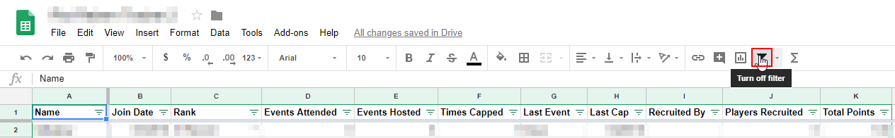

# Troubleshoot missing records

## For recently added records

### Refresh the page

If you can’t see recently added data, try to refresh the page. Choose your browser below:

* Google Chrome: At the top left, click **Reload this page**
* Firefox: At the top, click **Reload current page**
* Safari: **View &gt; Reload page**
* Microsoft Edge: On your keyboard, press **F5**

### Disable active filters

By default, filters stay active even after the page is refreshed, which can sometimes hide data from view. Follow these steps to disable filters:

1. With your spreadsheet open, click the **Clan List** sheet tab to make sure it is active.
2. Look at the column and row labels. If these labels are shaded **green** as in the screenshot below, a filter is active.

   

3. In the editing toolbar, click the **Funnel icon** to disable all active filters on the sheet. Notice the row and column labels are now grey: 

   

### Clear cache and cookies

If refreshing the page does not work, try clearing your browser's cache and cookies. Choose your browser below:

* [Google Chrome](https://support.google.com/accounts/answer/32050?co=GENIE.Platform%3DDesktop&oco=1)
* [Firefox](https://support.mozilla.org/en-US/kb/delete-browsing-search-download-history-firefox#w_how-do-i-clear-my-history) \(in the Details dialog, check **Cache** and **Cookies**\)
* [Safari](https://support.apple.com/guide/safari/manage-cookies-and-website-data-sfri11471/mac)
* [Microsoft Edge](https://support.microsoft.com/en-us/help/10607/microsoft-edge-view-delete-browser-history)

## For recently removed records

To recover a record that was deleted by mistake, see the help topic linked below.



